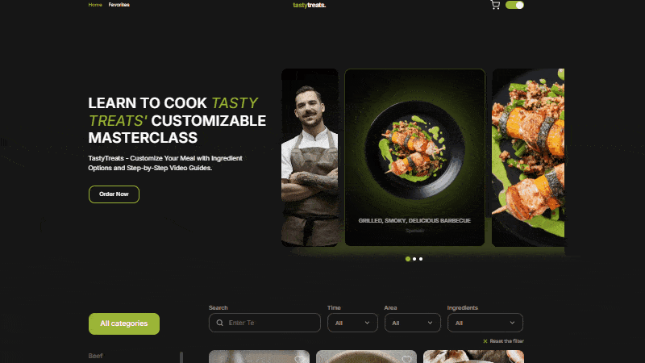
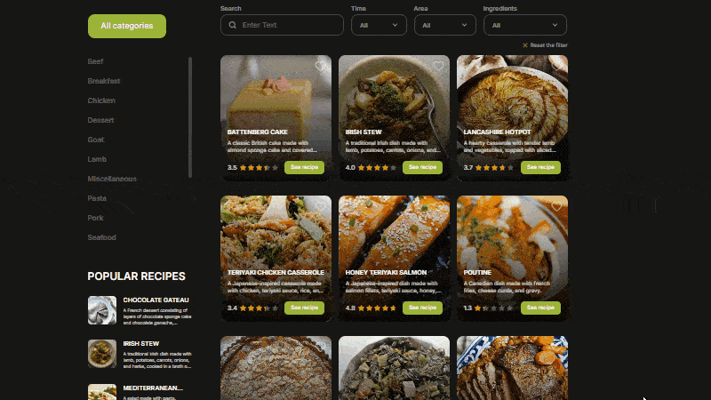
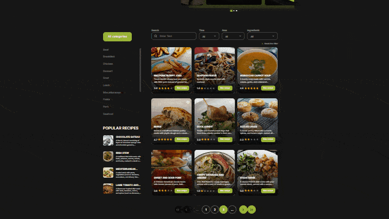
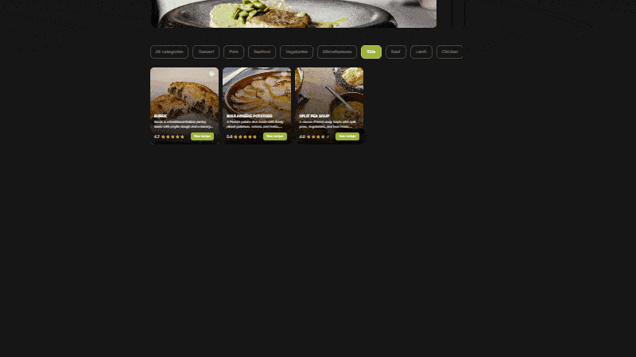

# 🍽️ Tasty Treats — Recipe Web Application


[](https://sokolovskyi-dev.github.io/Tasty-treats/)
[](https://github.com/sokolovskyi-dev/Tasty-treats)

Tasty Treats is a modern, responsive recipe web application featuring rich UI,
smart filtering, and a clean UX.

This project was originally built as a team collaboration, where I acted as the
team lead. The full commit history is preserved. I have rewritten the entire
project from scratch, improving structure, optimizing performance, and applying
best practices to solidify my frontend development skills. The project was
optimized for smooth user experience and fast performance, with attention to
accessibility, UI responsiveness, and usability.

Note: This is a frontend-only project using a third-party public recipe API.

## Features

🎞️ Hero 3D Slider showcasing cooking masterclasses  
🔍 Advanced Filtering (category, region, ingredients, time, recipe name)  
🧾 Recipe Modals with:

- Video instructions
- Ratings and hashtags
- Ingredients and steps
- Add to Favorites
- Submit rating via form  
  ⭐ Favorites Page with filtering  
  📄 Paginated recipe gallery  
  🌓 Dark/Light theme toggle  
  ✅ Form validation  
  🎨 UI enhancements: animations, custom scrollbars

Special attention was given to UI consistency, form feedback, animated
interactions, and mobile responsiveness.

## Usage

At the top of the application, the header contains two main navigation buttons:
**Home** and **Favorites**. These buttons let users navigate between the main
page and their personal list of saved favorites.

The Hero section features an interactive 3D slider that visually presents
available cooking masterclasses. **Order** Now button opens a modal with a
validated form, where users can request a specific masterclass.

Below the Hero section, users can explore a dynamic recipe gallery with
intuitive pagination for navigating between pages. Filtering is available by
category, region, ingredients, preparation time, and recipe name. Each gallery
item is displayed as a recipe card. Clicking on a card opens a modal with a
large dish image and navigation arrows to browse other recipes images.

To see complete recipe details — including video instructions, ingredients,
hashtags, ratings, and cooking steps — the user must click the **See Recipe**
button inside the modal. This opens a modal window with detailed information.
There, a **Give a rating** button allows the user to open another modal to
submit a rating via a form.

Any recipe can be added to or removed from the Favorites list using a button in
the detailed modal or **heart-button** on the recipe card.

The Favorites page, accessible from the header, displays a gallery of saved
recipes. Users can filter their saved recipes by category, providing a
convenient way to organize and revisit preferred dishes.

The interface supports dark and light themes, animated transitions, and
validated form inputs to ensure smooth and user-friendly interaction across all
devices.

## Demo

Here are some key UI interactions demonstrated:

### 🎯 Hero Section

Interactive 3D slider with masterclass ordering form.



---

### 🧠 Gallery Filtering

Smart recipe filtering by category, area, ingredients, and preparation time.



---

### 📑 Pagination Logic

Custom pagination interface synchronized with API query parameters.



---

### ⭐ Favorites Page

Saving and viewing favorite recipes with category filtering.



## Tech Stack

- -F7DF1E?style=flat&logo=javascript&logoColor=black>)
- 
- 
- 
- 
- 

#### Libraries:

- 
- 
- 
- 
- 
- 
- 

#### Storage & Custom Logic:

- 
- 
- 

## 🔗Links

- 🔗 [Live Demo](https://sokolovskyi-dev.github.io/Tasty-treats/)
- 💻 [Source Code](https://github.com/sokolovskyi-dev/Tasty-treats)

## Installation

Install my-project with npm

```bash
git clone https://github.com/sokolovskyi-dev/Tasty-treats.git
cd Tasty-treats
npm install
npm start
```

## Highlights

- Rebuilt legacy team code into a clean, modular architecture
- Optimized performance and enhanced gallery responsiveness
- Separated UI logic from data services for better maintainability
- Designed a scalable SCSS structure with reusable, organized styles
- Developed flexible filtering logic with support for multiple criteria
- Integrated server-side pagination by managing API query parameters, combined
  with fully custom client-side logic for page rendering and navigation

## 🧠 What I Learned

- Rewriting legacy code into a clean, modular architecture
- Dynamic rendering and conditional UI logic
- Managing async workflows with axios and async/await
- Form validation and theme switching logic
- Using LocalStorage and SessionStorage to manage UI state
- Building fully responsive interfaces using Flexbox and Grid
- Organizing scalable styles with SCSS partials, structured by component and
  layout
- Implementing multi-criteria filtering with real-time UI updates
- Managing server-side pagination with query parameter handling and interface
  synchronization
- Enhancing user experience through transitions, feedback, and load states
